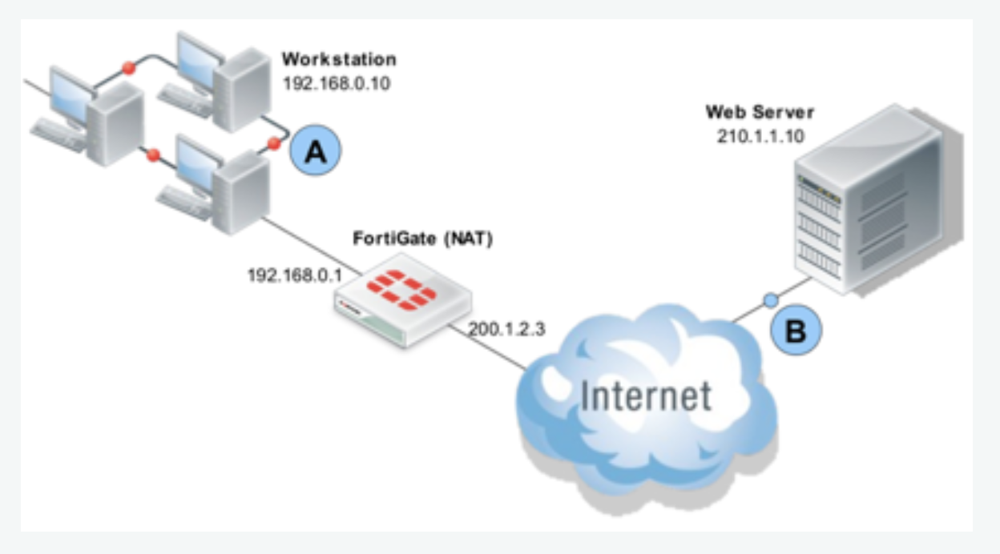
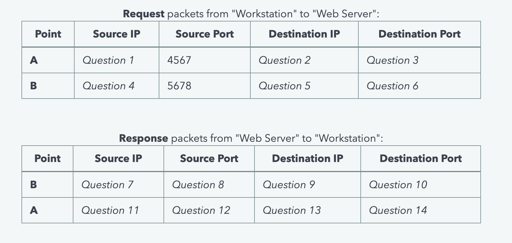

4. NAT Traffic

Complete the blanks in the following question with the appropriate answer.
Consider teh following network topology:




"Workstation" (192.168.0.10) is located on a LAN protected by a FortiGate firewall running in NAT mode. The internal and external IP addresses of the FortiGate are 192.168.0.1 and 200.1.2.3 respectively. The "Workstation" is now accessing a web site ( https://www.example.com ) hosted by the "Web Server" ( 210.1.1.10 ) to complete the tables below, answer the questions that follow. 




Request packets:

Question 1: What is the source IP for the request packet at point A?
Question 2: What is the destination IP for the request packet at point A?
Question 3: What is the destination port for the request packet at point A?

...

```
My Answer:
Request
point   source IP     source port   destination IP   Destination Port
A       192.168.0.10  4567          210.1.1.10       80
B       200.1.2.3     5678          210.1.1.10       80

Response 
point   source IP     source port   destination IP   Destination Port
B       210.1.1.10    80            200.1.2.3        5678
A       200.1.2.3     80            192.168.0.10     4567
```

